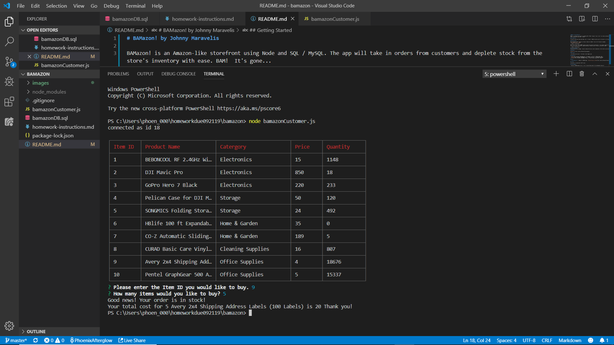
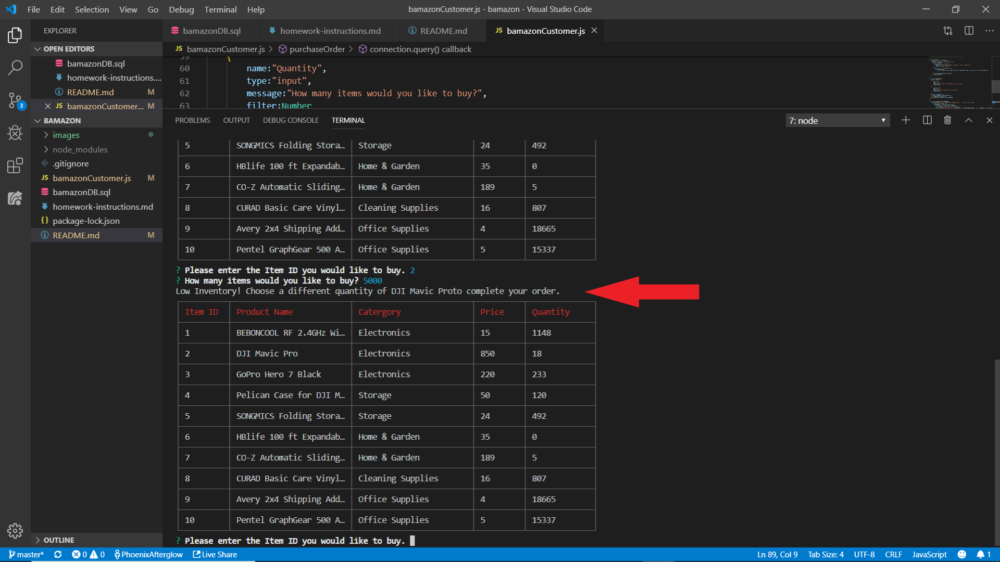

# BAMazon! by Johnny Maravelis

BAMazon! is an Amazon-like storefront using Node and SQL / MySQL. The app will take in orders from customers and deplete stock from the store's inventory with ease. BAM!  It's gone...

### Prerequisites

If you don't have Visual Studio Code, Node.js and / or Terminal / GitBash installed, you will not be able to run this app.

## Getting Started

Open the bamazonCustomer.js app file in Terminal / Bash and run NodeJS.  Here are the following line commands:
`node bamazonCustomer.js [ENTER]`

NOTE:  You will then receive a PROMPT of what you would like to buy and in what quantity.  If you request a number that is less than what is currently in inventory, then you will complete a purchase.  Otherwise, you will receive a "Low Inventory" prompt.

## Future Developments
It would be nice to do the Manager / Supervisor mode and then have a report per department so that inventory can also be added.

## Deployment

[Deployed link](https://github.com/PhoenixAfterglow/bamazon)

## Built With

* [Git](https://git-scm.com/) - The terminal / bash framework used

## Dependencies

* [mysql](https://www.npmjs.com/package/axios) - Allows Node.js to connect to a MySQL database (DB).
* [inquirer](https://www.npmjs.com/package/inquirer) - Inquirer helps with i.e. prompting user command.
* [cli-table](https://www.npmjs.com/package/cli-table) - CLI Table creates a simple "GUI" in Node.js

## Author

* **Johnny Maravelis** - *Homework for UNH Bootcamp* - [PhoenixAfterglow on GitHub](https://github.com/PhoenixAfterglow)

## License

This project is licensed under the MIT License.

## Acknowledgments

* Thank you to UNH Bootcamp instructor / TAs for clearing things up when I hit my head against many walls.